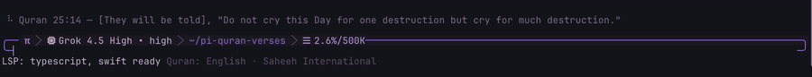
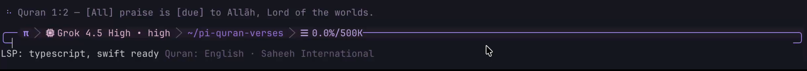

# pi-quran-verses



Pi extension that shows a Quran verse next to the working spinner while the agent is responding.

Only **complete-sentence** verses are used. Incomplete phrases, mid-sentence connectors, letter names (muqattaʿāt), and unfinished translation fragments are filtered out.

## Install

### From npm

```bash
pi install npm:pi-quran-verses
```

### From git

```bash
pi install git:github.com/mwijanarko1/pi-quran-verses
```

### Local path

```bash
pi install /absolute/path/to/pi-quran-verses
# or
pi install ./pi-quran-verses
```

Temporary test without installing:

```bash
pi -e ./pi-quran-verses
# or
pi -e npm:pi-quran-verses
```

Then `/reload` or restart Pi.

## Publish (maintainers)

```bash
npm login
npm publish
# or
bun publish
```

Verify:

```bash
npm view pi-quran-verses version
pi install npm:pi-quran-verses
```

## Usage

While Pi is working, the spinner message is replaced with a random verse from the selected translation:



A new verse is chosen on each agent turn (`turn_start`).

### Command

| Command | Description |
|---|---|
| `/quran-lang` | Choose language, then (if needed) translation |

Settings are stored at:

```text
~/.pi/agent/pi-quran-verses.json
```

Example:

```json
{
  "editionId": "en.saheeh"
}
```

## Languages and translations

Modeled on QuranScroll’s translation manifest.

| Language | Edition ID | Translator |
|---|---|---|
| Arabic | `ar.uthmani` | Uthmani |
| English | `en.saheeh` | Saheeh International (default) |
| English | `en.haleem` | MAS Abdel Haleem |
| English | `en.bridges` | Bridges Translation |
| Spanish | `es.isa-garcia` | Sheikh Isa Garcia |
| German | `de.bubenheim` | Bubenheim & Elyas |
| French | `fr.rashid-maash` | Rashid Maash |
| Urdu | `ur.tafheem-maududi` | Tafheem e Qur'an - Maududi |
| Urdu | `ur.maududi-roman` | Abul Ala Maududi (Roman Urdu) |
| Urdu | `ur.tafsir-usmani` | Tafsir E Usmani |
| Urdu | `ur.bayan-ul-quran` | Bayan-ul-Quran |
| Indonesian | `id.indonesian` | Indonesian Islamic Affairs Ministry |

## How verse selection works

1. Start from the complete-thought list in `source/quotable-verses.md` (from the Quran wiki synthesis).
2. Gate those refs through an English Saheeh International sentence filter so only standalone sentences remain.
3. Keep spinner-friendly length (≤ 140 characters).
4. Build per-language verse pools into `extensions/data/editions.json`.

At runtime the extension only reads `extensions/data/editions.json` and the user settings file. No network calls.

### Sentence filter (high level)

Rejected examples:

- letter names: `Alif, Lām, Meem.`
- unfinished endings: trailing `-`, `,`, `;`
- short fragments
- dependent openers needing prior context (`Who…`, `That they…`, `Abiding…`)
- unclosed quotes/brackets

## Package layout

```text
pi-quran-verses/
├── package.json                 # pi package manifest
├── README.md
├── LICENSE
├── extensions/
│   ├── index.ts                 # extension entrypoint
│   └── data/
│       └── editions.json        # bundled verse pools
├── scripts/
│   └── build-verses.mjs         # rebuild editions.json
└── source/                      # build inputs (not published)
    ├── quotable-verses.md
    ├── sentence-refs.json
    └── translations/
```

Published package contents (`files` in `package.json`):

- `extensions/`
- `README.md`
- `LICENSE`

## Rebuild verse data

If you update the quotable list or translation sources:

```bash
node scripts/build-verses.mjs
```

Then `/reload` Pi.

Translation source files live in `source/translations/` (QuranScroll QUL simple JSON format, plus Arabic and German).

## Development checks

```bash
npm pack --dry-run
pi -e . --list-models
```

## Notes

- This package does not send verses to the model context; it only changes the working spinner UI.
- Default edition is `en.saheeh`.
- German is included even though QuranScroll currently does not ship it; other languages follow QuranScroll’s editions.

## More docs

- [docs/EXTENSION.md](docs/EXTENSION.md) — runtime behavior, data model, build pipeline, verification
